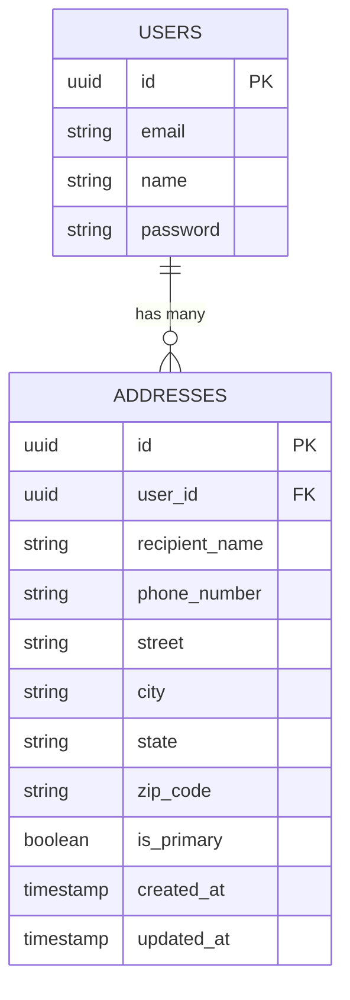

```mermaid
erDiagram
    USERS ||--o{ ADDRESSES : "has many"
    
    USERS {
        uuid id PK
        string email
        string name
        string password
    }

    ADDRESSES {
        uuid id PK
        uuid user_id FK
        string recipient_name
        string phone_number
        string street
        string city
        string state
        string zip_code
        boolean is_primary
        timestamp created_at
        timestamp updated_at
    }
```
