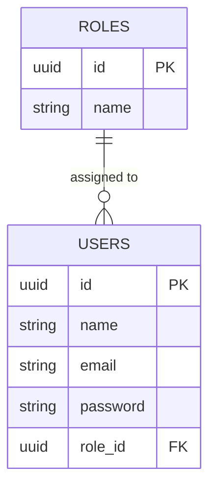

```mermaid
erDiagram
    ROLES ||--o{ USERS : "assigned to"
    
    ROLES {
        uuid id PK
        string name
    }

    USERS {
        uuid id PK
        string name
        string email
        string password
        uuid role_id FK
    }
```
