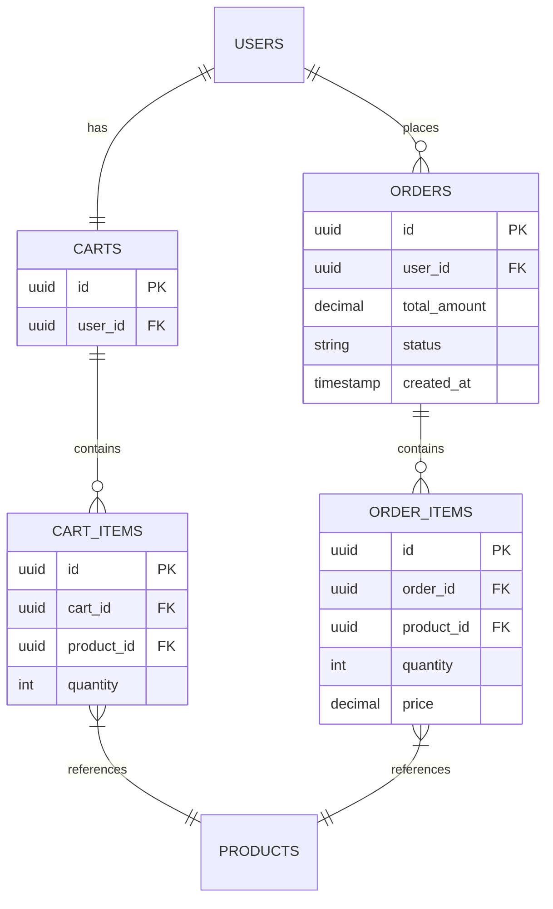

```mermaid
erDiagram
    USERS ||--o{ ORDERS : "places"
    USERS ||--|| CARTS : "has"
    
    CARTS ||--o{ CART_ITEMS : "contains"
    CART_ITEMS }|--|| PRODUCTS : "references"
    
    ORDERS ||--o{ ORDER_ITEMS : "contains"
    ORDER_ITEMS }|--|| PRODUCTS : "references"

    CARTS {
        uuid id PK
        uuid user_id FK
    }

    CART_ITEMS {
        uuid id PK
        uuid cart_id FK
        uuid product_id FK
        int quantity
    }

    ORDERS {
        uuid id PK
        uuid user_id FK
        decimal total_amount
        string status
        timestamp created_at
    }

    ORDER_ITEMS {
        uuid id PK
        uuid order_id FK
        uuid product_id FK
        int quantity
        decimal price
    }
```
