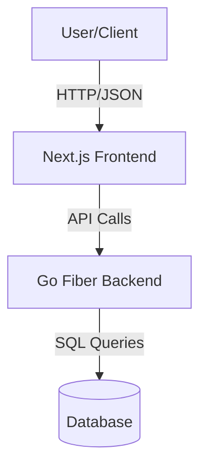

# System Flow & Architecture

## Overview
This document outlines the architecture and flow for a simple e-commerce system using **Go Fiber** for the backend and **Next.js** for the frontend.

## Architecture

## Tech Stack
- **Backend**: Go (Golang) with Fiber framework
- **Frontend**: Next.js (React)
- **Database**: PostgreSQL / MySQL (To be decided)
- **Authentication**: JWT (JSON Web Tokens)

## User Flows

### 1. Authentication Flow
- **Registration**: User sends `POST /api/register` with details -> Backend creates user -> Returns Success.
- **Login**: User sends `POST /api/login` -> Backend validates credentials -> Returns **JWT**.
- **Logout**: Client clears JWT.

### 2. Product Browsing
- **List Products**: Public access. `GET /api/products`.
- **Product Detail**: Public access. `GET /api/products/:id`.

### 3. Shopping Cart & Checkout (Authenticated)
- **Add to Cart**: `POST /api/cart`.
- **View Cart**: `GET /api/cart`.
- **Checkout**: 
    1. User reviews cart.
    2. User submits order `POST /api/orders`.
    3. Backend creates Order record, clears Cart.
    4. Backend returns Order ID.

### 4. Admin Flow (Optional/Future)
- **Manage Products**: CRUD operations on Products (Protected by Admin Role).

## Data Flow Diagram
1. **Request**: Next.js sends Fetch/Axios request with Authorization Header (if needed).
2. **Middleware**: Fiber Middleware validates JWT.
3. **Handler**: Controller processes request.
4. **Service/Repository**: Business logic and Database interaction.
5. **Response**: JSON response sent back to Next.js.
